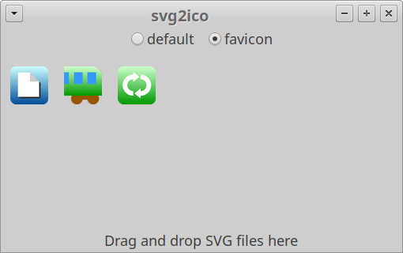

# SVG2ICO

`SVG2ICO` is the converter from SVG file to Windows .ico file.

## HOW TO USE

To install:

```bash
pip3 install git+https://github.com/yamakox/svg2ico.git
```

To run as GUI application:

```bash
svg2ico
```



To run as console application:

```bash
svg2ico -i example.svg -o icon.ico
```

Usage:

```bash
$ svg2ico --help
Usage: svg2ico [OPTIONS]

  Convert a SVG file to a Windows .ico file. If you don't provide an input
  file name, this program will show the window to drag and drop the SVG file.
  If you don't provide an output file name, the input file name will be used
  with a .ico extension.

Options:
  --preset [default|favicon]  The preset name of icon sizes.
  -i, --input TEXT            The input file name to convert to a Windows .ico
                              file.
  -o, --output TEXT           The output file name. If not provided, the input
                              file name will be used with a .ico extension.
  --version                   Show the version and exit.
  --help                      Show this message and exit.
```

`--preset` option selects the series of the icon sizes.

|preset|icon sizes|
|---|---|
|default|256, 128, 64, 48, 32, 24, 16|
|favicon|48, 32, 16|
